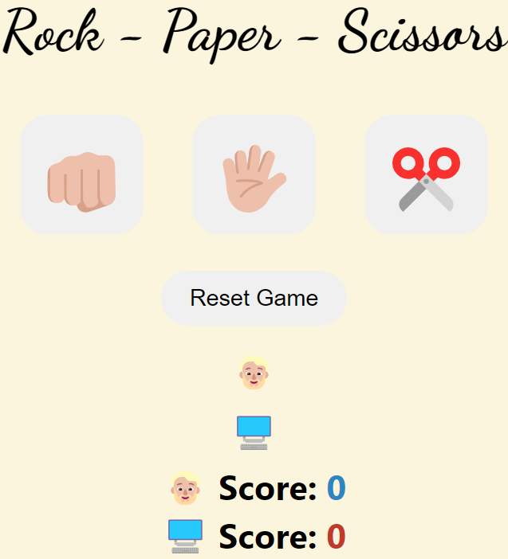

# Rock-Paper-Scissors Game
This is a simple Rock-Paper-Scissors game built using HTML, CSS, and JavaScript. The game lets the player compete against the computer by choosing Rock, Paper, or Scissors.

## Features
- Play against the computer
- Keeps track of player and computer scores
- Reset button to start fresh
- Simple and clean UI
- Fun emojis for user interaction
## How to Run
1. Clone this repository:
   ```bash
   git clone https://github.com/Jh0eL001/web-dev-projects.git
2. Open index.html in your browser to play the game.
## Demo

## Built With
- HTML
- CSS
- JavaScript
## License
This project is licensed under the MIT License - see the LICENSE file for details.
